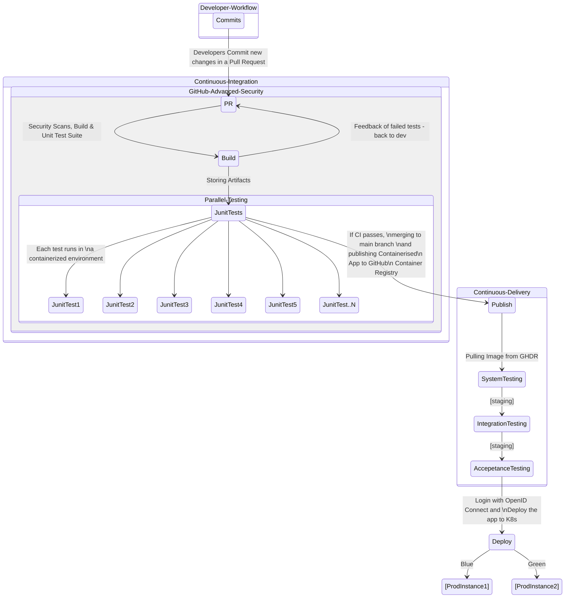

# Java Demo App

## The App

This is a simple Sales Manager Java App that stores sales items in a table presented in a web app.

This demo repo is designed to help understand some of **CI/CD** ([Continuous Integration](https://docs.github.com/en/enterprise-cloud@latest/actions/automating-builds-and-tests/about-continuous-integration)/[Continuous Delivery](https://docs.github.com/en/enterprise-cloud@latest/actions/deployment/about-deployments/about-continuous-deployment)) principles and best practices.

## The Setting

**Java** (Spring Boot framework) with **MVC** (Model View Controller) and **OOP** (Object Oriented Programming) design patterns.
Backend Database is Oracle XE 11g PDB (but can be used with other versions).
 
 *CI/CD Pipeline*
 [GitHub Actions](https://docs.github.com/en/enterprise-cloud@latest/actions) as the main CI/CD pipeline orchestrator

**Tools used to optimize the pipeline (See the `.github/workflows/ci.yml` for more detailed configuration).**
 - [Caching Dependencies to Speed Up Workflows](https://docs.github.com/en/enterprise-cloud@latest/actions/using-workflows/caching-dependencies-to-speed-up-workflows)
 - Reusing **Docker Layer Caching** from pervious docker builds with [action-docker-layer-caching](https://github.com/satackey/action-docker-layer-caching) or [build-push-action](https://github.com/docker/build-push-action) actions.
 - Using the [Metrix Strategy](https://docs.github.com/en/enterprise-cloud@latest/actions/using-jobs/using-a-matrix-for-your-jobs) to run unit tests in parallel to scale-out resources and reduce significant testing time.
 - Using the [Split Test Action](https://github.com/marketplace/actions/split-tests) to help splitting tests by previous testing time runs or line count (or other strategies) across multiple runners.
 - [GitHub Advanced Security](https://docs.github.com/en/enterprise-cloud@latest/get-started/learning-about-github/about-github-advanced-security) - Code Scanning using the [CodeQL analysis](https://docs.github.com/en/code-security/code-scanning/automatically-scanning-your-code-for-vulnerabilities-and-errors/configuring-the-codeql-workflow-for-compiled-languages) to scan for vulnerabilities.
 - [Liquibase Quality Checks](https://www.liquibase.com/quality-checks) - To help enforce Database schema changes best practices set by your DBA team, including naming conventions, grants & revokes, rollback scripts and security risks.
              
# CI/CD Diagram


## Building and Testing
[Maven](https://maven.apache.org/) is used as the project management for Building and Testing the application.
To build the application, you can run:
```
mvn clean package
```
It will generate a JAR file in the `target` folder with the following format `salesmanager-x.x.x-SNAPSHOT.jar`. </br>
To run the application, you can deploy the JAR file. For example:
```
java -jar target/salesmanager-0.0.6-SNAPSHOT.jar
```

# How to Demo
For easy demos without the need to stand up an Oracle database, an lightweight local [H2 database](https://www.h2database.com/html/main.html) (Oracle Mode) is setup by default in the `src/main/resources/application.properties` file. </br>
You can run the `./build_and_run_app.sh` helper shell script and interact with the web app on `localhost:8086`.
> You can easily use a [GitHub codespaces](https://docs.github.com/en/enterprise-cloud@latest/codespaces) with this repository. To set up your codespace, simply go to this repo [main page](https://github.com/octodemo/java-springboot-demo) --> Click **Code** --> Codespaces '+'. </br>


# Running the CI workflow
1. In order to run the workflow, you will need to [fork](https://docs.github.com/en/enterprise-cloud@latest/get-started/quickstart/fork-a-repo) this repo. </br>
2. Then, make sure to save the following environment variables in your repository secrets so you can successfully run the Database schema mirgations scripts (using [Liquibase](https://www.liquibase.com/) as the schema migration tool) on application startup and when running the tests. </br>

**Repository Secrets**
`LIQUIBASE_COMMAND_URL`
`LIQUIBASE_COMMAND_USERNAME`
`LIQUIBASE_COMMAND_PASSWORD`

### If you are going to use the same [dockerised service container](https://hub.docker.com/r/gvenzl/oracle-xe) in the CI job for dev, then the default values should be: </br>
`LIQUIBASE_COMMAND_URL` = `jdbc:oracle:thin:@oracle:1521/xe` </br>
`LIQUIBASE_COMMAND_USERNAME` = `SYSTEM` </br>
`LIQUIBASE_COMMAND_PASSWORD` = `ORACLE`

# Gitgraph Diagram - Developer Workflow


