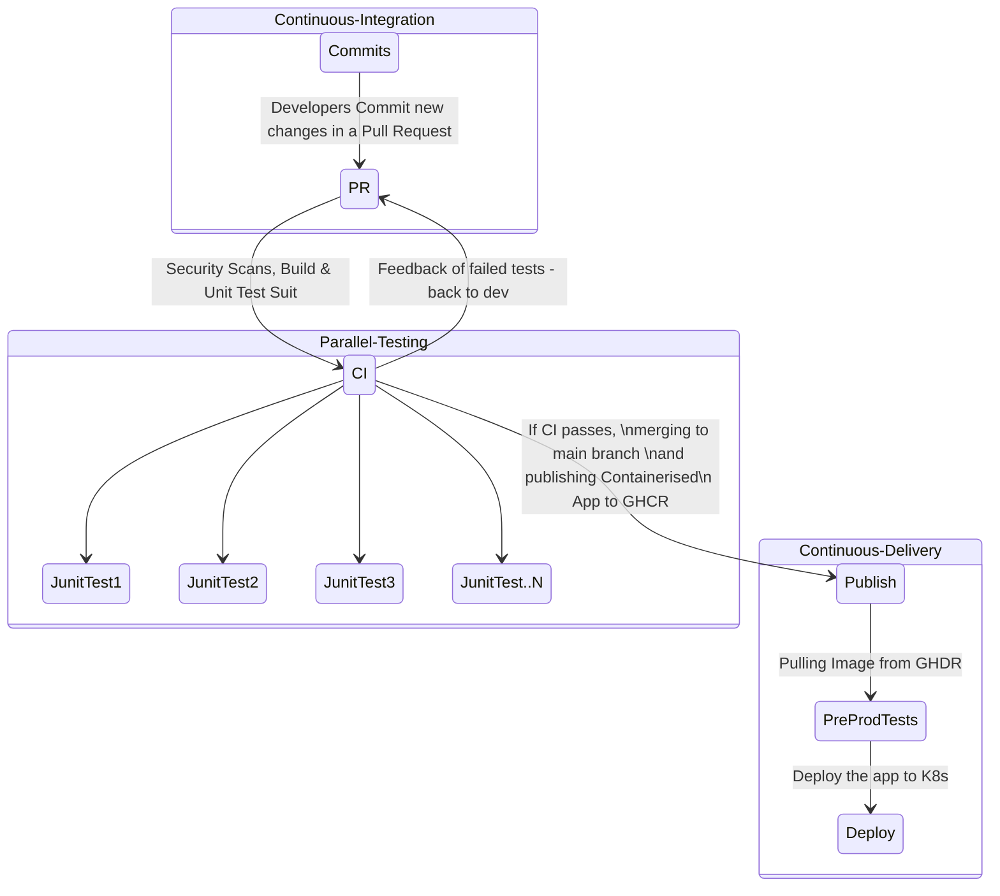
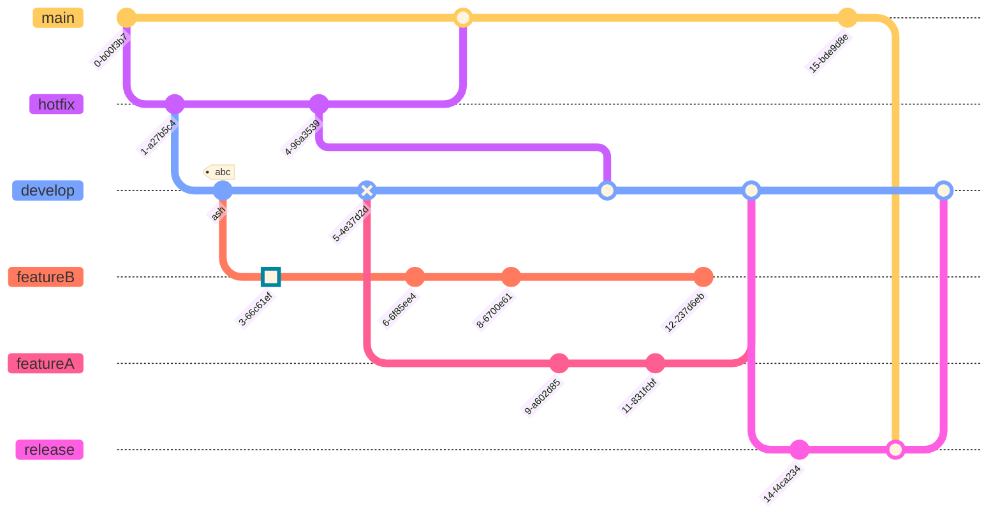

# Java Demo App

**The App**

This is a simple Sales Manager Java App that stores sales items in a table presented in a web app.

This demo repo is designed to help understand some of **CI/CD** (Continuous Integration/Continuous Delivery) principles and best practices.

**The Settings**

**Java** (Spring Boot framework) with **MVC** (Model View Controller) and **OOP** (Object Oriented Programming) design patterns.
 
 *CI/CD Pipeline*
 [GitHub Actions](https://docs.github.com/en/enterprise-cloud@latest/actions) as the main CI/CD pipeline orchestrator
Tools used to optimize the pipeline (See the `.github/workflows/ci.yml` for more detailed configuration).

 - [Caching Dependencies to Speed Up Workflows](https://docs.github.com/en/enterprise-cloud@latest/actions/using-workflows/caching-dependencies-to-speed-up-workflows)
 - [Using the Metrix Strategy to Run Unit Tests In Parallel](https://docs.github.com/en/enterprise-cloud@latest/actions/using-jobs/using-a-matrix-for-your-jobs)
              
# CI/CD Diagram

# Gitgraph Diagram - Developer Workflow

 *Building and Testing*
 - [Maven](https://maven.apache.org/) as the project management for Building and Testing the application.

User input data is stored in an Oracle (PDB) Database.

For easy demos, an H2 database (Oracle Mode) is setup by default in the `src/main/resources/application.properties` file.