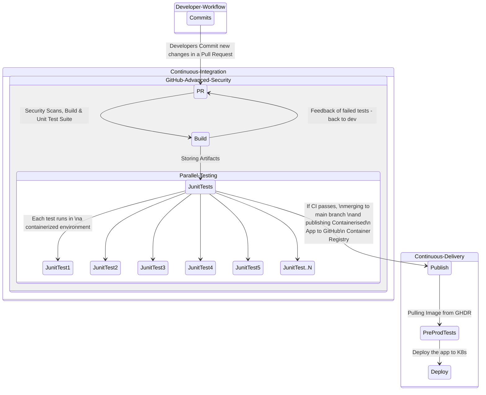
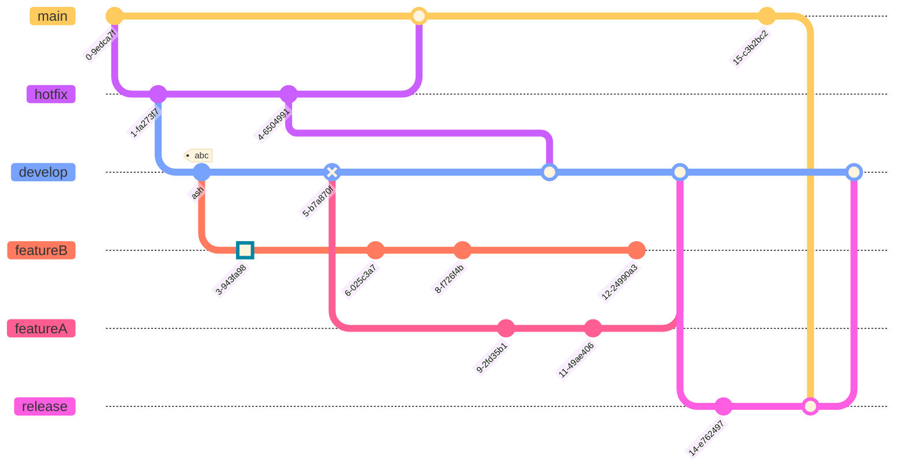

# Java Demo App

**The App**

This is a simple Sales Manager Java App that stores sales items in a table presented in a web app.

This demo repo is designed to help understand some of **CI/CD** (Continuous Integration/Continuous Delivery) principles and best practices.

**The Settings**

**Java** (Spring Boot framework) with **MVC** (Model View Controller) and **OOP** (Object Oriented Programming) design patterns.
 
 *CI/CD Pipeline*
 [GitHub Actions](https://docs.github.com/en/enterprise-cloud@latest/actions) as the main CI/CD pipeline orchestrator
Tools used to optimize the pipeline (See the `.github/workflows/ci.yml` for more detailed configuration).

 - [Caching Dependencies to Speed Up Workflows](https://docs.github.com/en/enterprise-cloud@latest/actions/using-workflows/caching-dependencies-to-speed-up-workflows)
 - [Using the Metrix Strategy to Run Unit Tests In Parallel](https://docs.github.com/en/enterprise-cloud@latest/actions/using-jobs/using-a-matrix-for-your-jobs)
              
# CI/CD Diagram

*Building and Testing*
 - [Maven](https://maven.apache.org/) as the project management for Building and Testing the application.
The user input data from the app's view is stored in an Oracle (PDB) Database.

# How to Demo
For easy demos, an H2 database (Oracle Mode) is setup by default in the `src/main/resources/application.properties` file.  
You can easily use a [GitHub codespaces](https://docs.github.com/en/enterprise-cloud@latest/codespaces) with this repository.  
To set up your codespace, simply go to this repo [main page](https://github.com/octodemo/java-springboot-demo) --> Click **Code** --> Codespaces '+'.  
You can run the `./build_and_run_app.sh` helper shell script and interact with the web app on `localhost:8086`.

Running the CI workflow
1. In order to run the workflow, you will need to [fork](https://docs.github.com/en/enterprise-cloud@latest/get-started/quickstart/fork-a-repo) this repo.  
2. Then, make sure to save the following environment variables in your repository secrets so you can successfully run the Database schema mirgations scripts (using [Liquibase](https://www.liquibase.com/) as the schema migration tool) on application startup and when running the tests.  

Repository Secrets
`LIQUIBASE_COMMAND_URL`
`LIQUIBASE_COMMAND_USERNAME`
`LIQUIBASE_COMMAND_PASSWORD`

If you are going to use the same [dockerised service container](https://hub.docker.com/r/gvenzl/oracle-xe) in the CI job for dev, then the default values should be:  
`LIQUIBASE_COMMAND_URL` = `jdbc:oracle:thin:@oracle:1521/xe`  
`LIQUIBASE_COMMAND_USERNAME` = `SYSTEM`  
`LIQUIBASE_COMMAND_PASSWORD` = `ORACLE`

# Gitgraph Diagram - Developer Workflow

