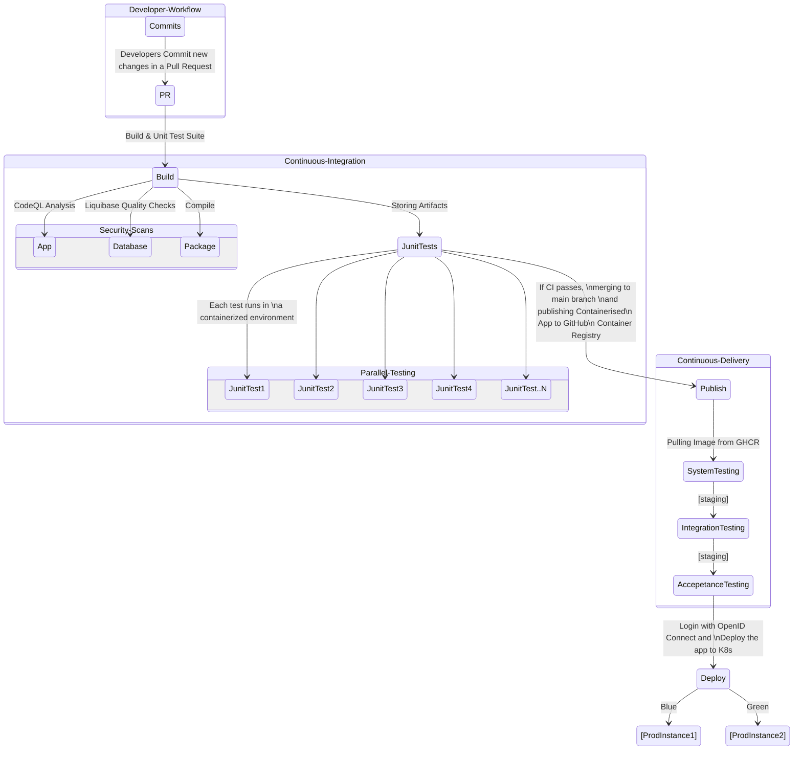
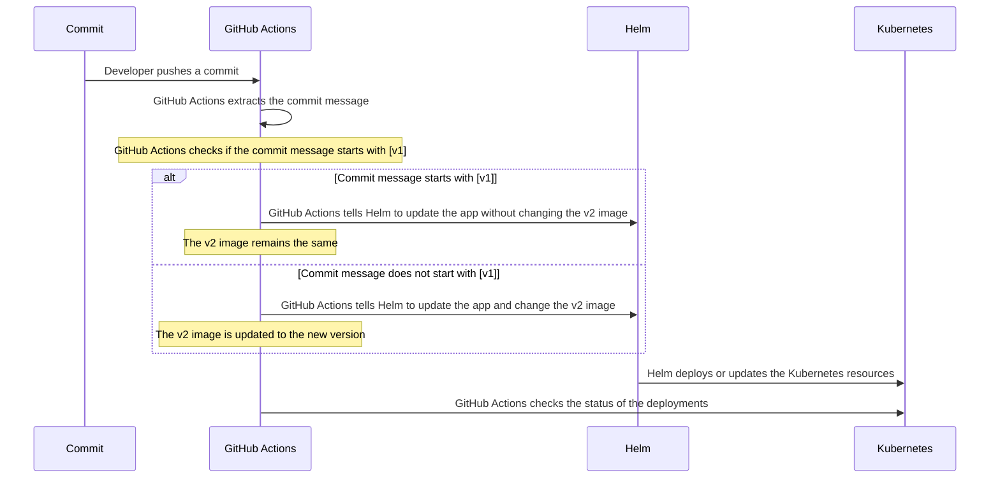
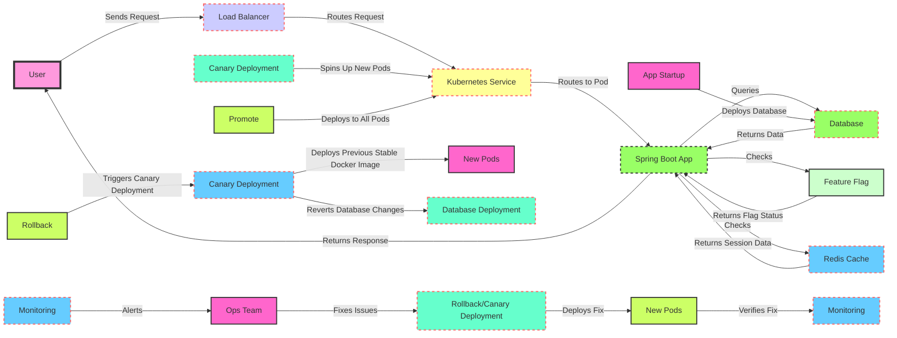

# Java Demo App

## Overview

This is a simple Sales Manager Java App that stores sales items in a table presented in a web app. This demo repo is designed to help understand some of **CI/CD** ([Continuous Integration](https://docs.github.com/en/enterprise-cloud@latest/actions/automating-builds-and-tests/about-continuous-integration)/[Continuous Delivery](https://docs.github.com/en/enterprise-cloud@latest/actions/deployment/about-deployments/about-continuous-deployment)) principles and best practices.

## Technology Stack

- **Language:** Java (Spring Boot framework)
- **Design Patterns:** MVC (Model View Controller) and OOP (Object Oriented Programming)
- **Database:** [PostreSQL 10.4](https://www.postgresql.org/docs/10/release-10-4.html) (compatible with other versions)
- **CI/CD Pipeline:** [GitHub Actions](https://docs.github.com/en/enterprise-cloud@latest/actions)

## CI/CD Pipeline

The pipeline is optimized using various tools. See the `.github/workflows/ci.yml` and `.github/workflows/cd.yml` for more detailed configuration.

### Continuous Integration

- [Caching Dependencies to Speed Up Workflows](https://docs.github.com/en/enterprise-cloud@latest/actions/using-workflows/caching-dependencies-to-speed-up-workflows)
- Docker Layer Caching with [action-docker-layer-caching](https://github.com/satackey/action-docker-layer-caching) or [build-push-action](https://github.com/docker/build-push-action) actions.
- [Metrix Strategy](https://docs.github.com/en/enterprise-cloud@latest/actions/using-jobs/using-a-matrix-for-your-jobs) for parallel unit testing.
- [Split Test Action](https://github.com/marketplace/actions/split-tests) for splitting tests across multiple runners.
- [GitHub Advanced Security](https://docs.github.com/en/enterprise-cloud@latest/get-started/learning-about-github/about-github-advanced-security) with [CodeQL analysis](https://docs.github.com/en/code-security/code-scanning/automatically-scanning-your-code-for-vulnerabilities-and-errors/configuring-the-codeql-workflow-for-compiled-languages).
- [Liquibase Quality Checks](https://www.liquibase.com/quality-checks) for enforcing database schema changes best practices.

### Continuous Delivery/Deployment

- [Environments](https://docs.github.com/en/actions/deployment/targeting-different-environments/using-environments-for-deployment) with an [approval step review](https://docs.github.com/en/actions/managing-workflow-runs/reviewing-deployments) prior to [deployments](https://docs.github.com/en/actions/deployment/about-deployments)
- [azure/login action](https://github.com/marketplace/actions/azure-login) for [OIDC (OpenID Connect)](https://docs.github.com/en/actions/deployment/security-hardening-your-deployments/about-security-hardening-with-openid-connect) functionality.
- [Canary or Blue-Green deployments](https://github.com/Azure-Samples/aks-bluegreen-canary) in an AKS (Azure Kubernetes) Cluster.

## CI/CD Diagram


## Blue-Green Deployment Strategy Diagram


## App deployment flow - in this diagram
## User Request Flow
1. User sends a request to the Load Balancer.
2. Load Balancer routes the request to the Kubernetes Service.
3. Kubernetes Service routes the request to the Spring Boot App.
4. Spring Boot App queries the Database.
5. Database returns data to the Spring Boot App.
6. Spring Boot App checks the Feature Flag.
7. Feature Flag returns the flag status to the Spring Boot App.
8. Spring Boot App checks the Redis Cache.
9. Redis Cache returns the session data to the Spring Boot App.
10. Spring Boot App returns the response to the User.

## Deployment Process
1. App Startup deploys the Database.
2. Canary Deployment spins up new pods.
3. Rollback triggers a Canary Deployment.
4. Canary Deployment deploys the previous stable Docker image.
5. Canary Deployment reverts database changes.
6. Promote deploys to all pods.

## Monitoring and Issue Resolution
1. Monitoring alerts the Ops Team.
2. Ops Team fixes issues.
3. Rollback/Canary Deployment deploys the fix.
4. New Pods verifies the fix.
5. Monitoring verifies the fix.



## GitFlow Diagram
```mermaid
graph TB
  A[Local Branch] -->|pull request| B((Main Branch))
  B --> C{GitHub Actions Workflow}
  C -->|Build| D[GitHub Artifacts/Container Registry]
  C -->|Infrastructure Build| E[K8s Configuration]
  D --> F{GitHub Actions Test Job}
  E --> F
  F -->|tests pass| G[Unit Tests]
  G -->|tests pass| H[Merge to Main Branch]
  H --> I[Deployment Approval]
  I --> J[Canary Deployment]
  J -->|monitoring| K{Decision Point}
  K -->|rollback| L[Revert Commit]
  K -->|promote| M[Full Deployment]
  style A fill:#f9d,stroke:#333,stroke-width:4px
  style B fill:#ccf,stroke:#f66,stroke-width:2px,stroke-dasharray: 5, 5
  style C fill:#ff9,stroke:#f66,stroke-width:2px,stroke-dasharray: 5, 5
  style D fill:#9f6,stroke:#333,stroke-width:2px,stroke-dasharray: 5, 5
  style E fill:#9f6,stroke:#f66,stroke-width:2px,stroke-dasharray: 5, 5
  style F fill:#cfc,stroke:#333,stroke-width:2px
  style G fill:#6cf,stroke:#f66,stroke-width:2px,stroke-dasharray: 5, 5
  style H fill:#f6c,stroke:#333,stroke-width:2px
  style I fill:#6fc,stroke:#f66,stroke-width:2px,stroke-dasharray: 5, 5
  style J fill:#cf6,stroke:#333,stroke-width:2px
  style K fill:#6cf,stroke:#f66,stroke-width:2px,stroke-dasharray: 5, 5
  style L fill:#f6c,stroke:#333,stroke-width:2px
  style M fill:#6fc,stroke:#f66,stroke-width:2px,stroke-dasharray: 5, 5
```## PD-463
## PD-464
## PD-465
## PD-466
## PD-467
